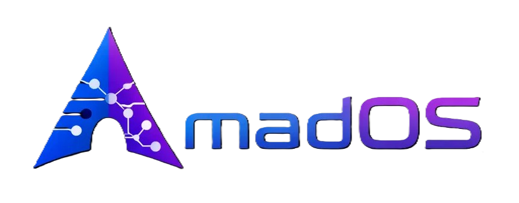

<div align="center">



# madOS

**AI-Orchestrated Arch Linux System**

[](https://github.com/madkoding/mad-os/actions)
[](LICENSE)
[](https://github.com/madkoding/mad-os/releases) 
[](https://madkoding.github.io/mad-os/)

</div>

## Download

- **Stable:** [madOS Website](https://madkoding.github.io/mad-os/) (recommended)
- **Beta:** [Beta Downloads](https://madkoding.github.io/mad-os/)

## Quick Start

```bash
# 1. Create bootable USB
sudo dd if=madOS-*.iso of=/dev/sdX bs=4M status=progress oflag=sync

# 2. Boot from USB - Sway auto-starts

# 3. Run installer
sudo install-mados
```

## Features

- **OpenCode AI** - Integrated AI assistant for system orchestration
- **Low-RAM** - Optimized for 1.9GB+ systems
- **Sway** - Lightweight Wayland compositor (~67MB RAM)
- **Developer Ready** - Node.js, npm, Git, VS Code

## Documentation

Full documentation: [madOS Wiki](https://github.com/madkoding/mad-os/wiki)

## License

MIT License - See [LICENSE](LICENSE)
